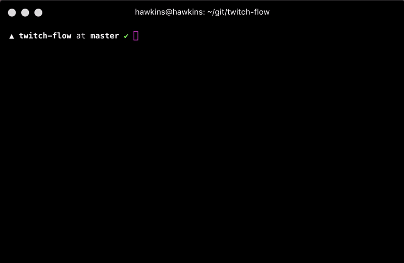

# interactive-scripts

List all of your npm scripts from `package.json` and run one of your choosing in just one short command :)

## Installation

Just add this to your global `npm` packages like so: `npm install --global interactive-scripts` or `yarn global add interactive-scripts`.

## Usage

After installing globally with `npm` or `yarn`, simply run `scripts` in your terminal.

See the example gif where I demonstrate its use in an actual project:

## Why not just `npm run` or `yarn run`?

Good question.

`yarn run` already prints out the project's commands and opens a prompt for you to type the name of the command to run.

`npm run` also lists out the project's commands, but does not open a prompt.

So, the main differences between using your existing package manager's `run` and `scripts` is that `scripts`...

- provides a scrolling interface of all of your scripts instead of listing them all out at once
- allows you to select the command to run via arrow keys and enter instead of typing the name
- is a whopping **1** character shorter than `yarn run` 🤷
